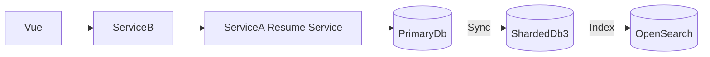

# Worked Examples

Four tickets at four depths. Note how much analysis each one does **not** do.

---

## Example 1 - Bug Ticket (single repository, scoped deep scan)

> **T12345** - Talent profile page sometimes returns "not found" for valid
> userId values ending in 5-9.

### What the skill does

```
Repository Scope: ServiceA        Type: Bug
```

**Memory loaded** (advisory only): `ServiceA/database.md`, `routing.md`,
`shared/shard-routing.md`. Memory says ShardedDb routing is `INFERRED: userId last
digit may determine shard`.

**Blocking check:** `STATUS: READY FOR ANALYSIS`. Redis topology is `UNKNOWN` in
memory - this flow does not touch Redis, so it is not investigated.

**Scope:** the read path only. Write path, sync mechanism and OpenSearch are
explicitly out of scope.

**Scoped scan:** controller -> `TalentService` -> `TalentRepository` ->
`DbConnectionFactory`. Four files. Stop - that is enough.

**Existing flow** (no Mermaid needed - single service, single read):

```
GET /talent/{userId} -> TalentController -> TalentService -> TalentRepository
  -> DbConnectionFactory.GetShardedDbConnection(shard) -> ShardedDb{n}
```
**Root cause:**

```
Root Cause: CONFIRMED
DbConnectionFactory maps shards 0-9 onto server SQL10 only.
Shards 5-9 live on SQL11, so those lookups hit an empty shard.
Evidence: ServiceA/src/Data/DbConnectionFactory.cs:48
```

**Solution:** map shard -> server as `shard <= 4 ? SQL10 : SQL11`, using the
existing connection-string configuration. No refactor of the factory.

```
function GetShardConnection(userId):
    shard  = userId % 10
    server = shard <= 4 ? SQL10 : SQL11
    return connections[server][shard]
```

**Test plan:** userId ending 0, 3 (regression - already worked), 5, 9 (the bug),
plus a non-existent userId (still 404).

**Gate 5 (three lines):** baseline `git merge-base origin/main HEAD`; dimensions 1-6
`unchanged` (a read path, no auth / write / side effect / log change); dimension 7 -
the factory is called by two repositories, both read-only, both unaffected by a
wider shard map. No delta, no risk. The factory itself is shared code, so the fix
is a mapping correction inside it, not a new parameter for callers to pass.

**Approval Gate #1** -> `AWAITING USER APPROVAL TO IMPLEMENT`. After approval:
branch by convention priority (no repository convention or history here ->
fallback `feature/T12345`), one-file change, build, tests, diff.

**Memory Delta:** `UPDATE repositories/ServiceA/routing.md` - ShardedDb shard section
`INFERRED -> CONFIRMED` (`userId % 10`), plus the server split SQL10 = 0-4 /
SQL11 = 5-9 with Evidence + Last Verified. No promotion to `shared/` yet: the
evidence exists in one repository only.

**Approval Gate #2** -> `AWAITING USER APPROVAL TO LOCAL COMMIT`.
```
[fix] [T12345] ShardedDb shard 5-9 routes to SQL11
Bundle: T12000
```

### What the skill deliberately did NOT do

Read the sync mechanism; scan ServiceB; document Redis; diagram the full talent
architecture; refactor `DbConnectionFactory`.

---

## Example 2 - Feature Ticket (minimal integration scan)

> **T12800** - Add an endpoint returning a talent's last 10 viewed companies.

```
Repository Scope: ServiceA        Type: Feature
```

**Memory loaded:** `repositories/ServiceA/patterns.md`, `database.md`. Memory
notes `empViewedLog` may shard on the **last two digits** - `INFERRED`, so it
must be verified in code, not assumed.

**Blocking check:** the ticket does not say whether "viewed" means company page
views or job views. Two readings produce different tables -> `STATUS: BLOCKED`,
one question asked, then resumed once answered.

**Minimal integration scan** - only what is needed to integrate:

```
Auth:            existing [Authorize] talent token filter
API convention:  /api/talent/{userId}/...  returning ApiResult<T>
Similar feature: TalentAppliedJobsController  <- copy this shape
Service pattern: ITalentViewService + DI registration in Startup
Repo pattern:    Dapper + DbConnectionFactory
DB:              empViewedLog{nn} - verified in code: userId % 100
Logging:         ILogger injected, existing error-handling middleware
```

Stop. No root cause, no bottleneck analysis, no architecture diagram. Gate 5 runs
the short form: a new read endpoint with no existing caller and no shared code
touched - auth and logging match the sibling feature, no side effect, no write.

**Gate 3's `Reuse` column** keeps the diff small: the ticket needs a shard-suffixed
table name, and a sibling repository already does that arithmetic against the
existing factory. `SUFFICIENT AS IS` - the new method calls them. No new helper, no
`TableNameResolver`, no extra factory parameter "so it can also do two digits". A
second way to compute a table name would have been the regression.

```
function GetRecentViewedCompanies(userId, take = 10):
    table = "empViewedLog" + pad2(userId % 100)
    rows  = repository.queryTop(table, userId, take)
    return map(rows -> CompanyViewDto)
```

**Plan:** controller, service, repository method, DI registration, unit test for
table-name selection, integration test for the endpoint. **Test plan:** happy
path; userId ending `07` (two-digit padding boundary); talent with no history
(empty list, not 404); unauthorised request.

**Memory Delta:** `UPDATE repositories/ServiceA/database.md` - empViewedLog
sharding `INFERRED -> CONFIRMED` (`userId % 100`, zero padded). Evidence:
`ServiceA/src/Data/ViewedLogRepository.cs:31`.

---

## Example 3 - Cross-Repository Ticket

> **T13100** - Resume updates made on the site do not appear in search results
> for up to an hour.

```
Repository Scope: Frontend -> ServiceB -> ServiceA -> PrimaryDb -> ShardedDb -> OpenSearch
Type: Bug
```
**Memory loaded - only the repos in this flow:** `Frontend/overview.md`,
`ServiceB/overview.md`, `ServiceA/database.md`, `shared/shard-routing.md`,
`shared/search/opensearch-query.md`, `global/database.md`. Not loaded: `ServiceD`,
`shared/redis.md`, or any other repository - they are not in this flow.

**This ticket earns a diagram** (multiple services, sync, search index):


**Where memory and evidence disagree:** memory says `CONFIRMED - ServiceA writes
talent data to PrimaryDb`, but the code shows `ResumeSummaryRepository` writing ShardedDb
directly for one field. **Current evidence wins**; the exception is recorded, the
general rule kept.

**Root cause:**

```
Root Cause: CANDIDATE
The resume write reaches PrimaryDb correctly, but the OpenSearch indexer subscribes
to ShardedDb, so the visible delay equals the PrimaryDb -> ShardedDb sync interval.
Evidence: indexer config points at ShardedDb; sync job interval is scheduled.
What would confirm it: compare row timestamps in PrimaryDb vs ShardedDb3 for one userId
(read-only SELECT - no mutation needed).
```

**Impact analysis** crosses repositories, so it is per repository: ServiceB unchanged;
ServiceA write path unchanged; only the indexer trigger changes. **Gate 5** centres
on dimension 7 - the indexer is shared, so its other subscribers are enumerated
before its trigger is re-pointed, and re-pointing it is a shared-code change that
needs the user's decision (Gate 3, `EXTENSION NEEDED`), not a unilateral edit.

**Memory Delta:**

```
CORRECT repositories/ServiceA/database.md
        Fact: most standard talent writes use PrimaryDb as source before ShardedDb sync.
        Exceptions: ResumeSummaryRepository writes ShardedDb directly for <field>.
ADD     shared/search/opensearch-query.md
        Indexer subscribes to ShardedDb, not PrimaryDb.  Status: CONFIRMED.
+ append to corrections.md
```

No attempt is made to force ServiceA and ServiceC into one rule; the `shared/`
entry keeps both behaviours rather than picking one.

---

## Example 4 - Re-pointing a page at an existing backend flow (Gate 5)

> **T14200** - Page B's contact-change entry must be replaced by a verification
> modal, reusing the verification endpoints Page A already calls.

A UI ticket whose diff is mostly a view file - exactly the shape that hides
contract regressions. Gate 5 run 1 is filled from the **authoritative baseline**
(`git merge-base origin/main HEAD`), never from the branch tip:
| # | Dimension | Baseline (Page B's old endpoints) | Planned (Page A's endpoints) | Intended? | Risk |
|---|---|---|---|---|---|
| 1 | Security / CSRF | old actions validate an anti-forgery token | new actions do not | **NO** | HIGH |
| 2 | Server-side enforcement | none: a direct-update action still writes the field without a code | unchanged - the UI entry is removed, the route is not | **NO** | HIGH |
| 4 | Transaction / ACID | field write + flag update + history record, no explicit boundary | same, plus a mail send that cannot be rolled back | partly | MEDIUM |
| 5 | Side effects | old success path also wrote a change-history record and sent a notification | new path does neither | **NO** | HIGH |
| 6 | Audit | that history record is the only audit trail for this field | lost | **NO** | HIGH |
| 7 | Callers | the reused endpoints are already called by Page A | tightening them changes Page A too | n/a | HIGH |

What this produces before any code is written:

- Rows 1 + 7: adding the token to a **shared** endpoint breaks Page A unless it is
  updated in the same change (P3) - and the repository cannot prove it is the only
  caller, so `UNKNOWN CALLERS` with the consequence stated.
- Row 2 is P1: removing the entry button from the view closes nothing; the bypass
  is the route, and only a server-side check closes it.
- Rows 5 + 6: "the feature still works" was true in every manual test; the history
  record and the notification were missing anyway.
- Row 4 and P4: the mail is not rollback-able, so it goes after the commit; the
  send button fires before it is disabled, so a double-click produces two requests
  against a `read -> check -> write` resend window.

A later round of the same ticket restored both effects - and the Side-effect
Parity sub-table still reported deltas, because the diff also moved the
notification onto a background task and wrapped the domain hook in a catch-and-log
while the action kept returning success. Same symbols in the diff, four of the six
attributes changed: sync/async, failure semantics, reliability, order. Two of the
five checks fired (sync -> background; exception swallowed but success returned),
and a third when some call sites of the same effect were left inline while others
were wrapped, giving one behaviour two failure semantics. None of it was asked
for, so all of it is `NEEDS DECISION` - not "already covered, the method is still
called".

Every `NO` / `NEEDS DECISION` row is resolved in the plan or carried to an
approval gate, and each becomes a regression case in the test plan and in
`<Ticket>驗收標準.md`. What Gate 5 does **not** do: re-open expiry / attempt-limit
/ daily-limit rules a reference document describes but the ticket never required
(HARD RULE 12), or extract the two page handlers into a shared component (P5).
